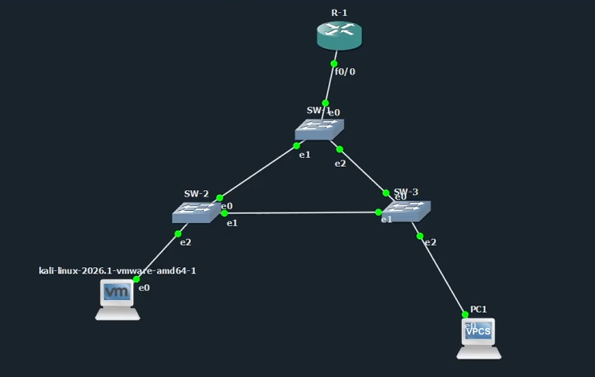
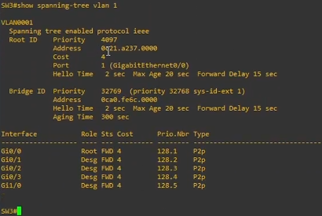
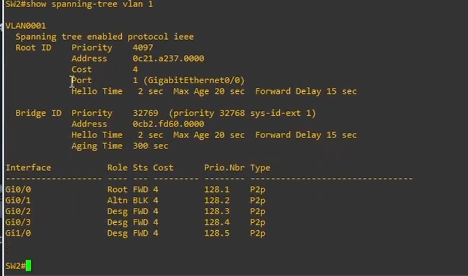
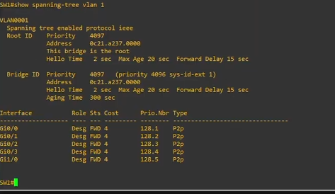
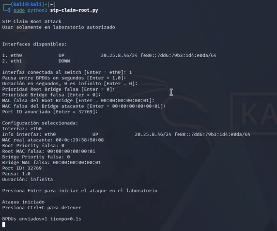
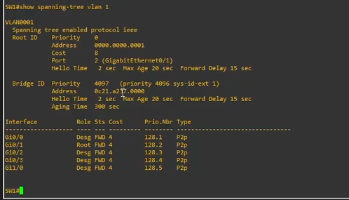
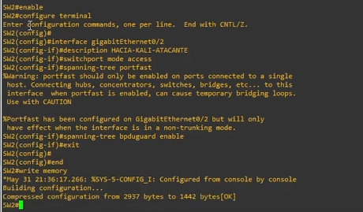
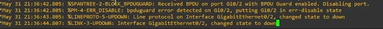
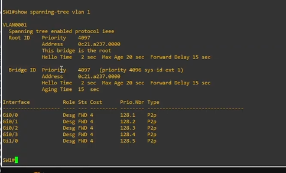

# STP Claim Root Attack Lab


## Información del proyecto

- **Autor:** Michael David Robles Fermín
- **Matrícula:** 2025-0845
- **Asignatura:** Seguridad de Redes
- **Repositorio:** https://github.com/iClexi/STP-Claim-Root-Attack
- **Video:** https://youtu.be/ZiQyB0NBzlY?si=m2-uQIhz8ew9lkzT
- **Documentación técnica profesional:** [docs/documentacion-tecnica-profesional.pdf](docs/documentacion-tecnica-profesional.pdf)

## Aviso de uso responsable

Este proyecto fue desarrollado únicamente con fines educativos, académicos y de laboratorio controlado. Las pruebas deben ejecutarse solamente en entornos propios o autorizados como GNS3, EVE-NG, PNETLab o laboratorios internos. No debe utilizarse en redes públicas, empresariales o de terceros sin autorización explícita.

## Objetivo del laboratorio

Demostrar cómo un atacante conectado a un puerto de acceso puede enviar BPDUs falsas para intentar reclamar el rol de **Root Bridge** dentro de una topología STP. Posteriormente, se aplica **BPDU Guard** en el puerto conectado a Kali para bloquear BPDUs no autorizadas y proteger la estabilidad de la topología.

## Topología de laboratorio



## Flujo del laboratorio

### 1. Estado STP inicial en SW3

Antes del ataque, SW3 reconoce como Root Bridge legítimo a SW1:

```cisco
show spanning-tree vlan 1
```



### 2. Estado STP inicial en SW2

SW2 también reconoce a SW1 como Root Bridge y muestra el puerto root correspondiente:

```cisco
show spanning-tree vlan 1
```



### 3. SW1 como Root Bridge legítimo

En SW1 se evidencia que este switch es el Root Bridge legítimo antes del ataque:

```cisco
show spanning-tree vlan 1
```



### 4. Ejecución del ataque desde Kali

El ataque se ejecuta desde Kali Linux usando el script:

```bash
sudo python3 stp-claim-root.py
```

El script anuncia un Root Bridge falso con prioridad `0` y dirección MAC `00:00:00:00:00:01`.



### 5. Cambio del Root Bridge

Después del ataque, SW1 deja de verse como root y acepta un Root ID falso con prioridad `0` y MAC `0000.0000.0001`:

```cisco
show spanning-tree vlan 1
```



### 6. Aplicación de BPDU Guard

En SW2, que es el switch donde está conectado Kali, se configura el puerto hacia Kali como puerto de acceso con PortFast y BPDU Guard:

```cisco
enable
configure terminal
interface gigabitEthernet0/2
description HACIA-KALI-ATACANTE
switchport mode access
spanning-tree portfast
spanning-tree bpduguard enable
end
write memory
```



### 7. Violación detectada por BPDU Guard

Al volver a enviar BPDUs desde Kali, SW2 detecta tráfico BPDU en el puerto protegido y coloca la interfaz en estado err-disabled:

```cisco
show logging
show interfaces status
```



### 8. Verificación posterior a la mitigación

Después de aplicar la mitigación, SW1 mantiene el rol de Root Bridge legítimo aunque el ataque continúe:

```cisco
show spanning-tree vlan 1
```



## Contramedida aplicada

La defensa principal aplicada fue **BPDU Guard** en el puerto de acceso conectado a Kali. Esta medida evita que un dispositivo final o no autorizado participe en STP. Si el puerto recibe una BPDU, el switch lo deshabilita automáticamente para proteger la topología.

## Comandos principales de mitigación

```cisco
enable
configure terminal
interface gigabitEthernet0/2
description HACIA-KALI-ATACANTE
switchport mode access
spanning-tree portfast
spanning-tree bpduguard enable
end
write memory
```

## Enlaces directos

- **Repositorio:** https://github.com/iClexi/STP-Claim-Root-Attack
- **Video:** https://youtu.be/ZiQyB0NBzlY?si=m2-uQIhz8ew9lkzT
- **Documentación técnica profesional:** [docs/documentacion-tecnica-profesional.pdf](docs/documentacion-tecnica-profesional.pdf)

## Conclusión

El ataque STP Claim Root demostró que un dispositivo conectado a un puerto de acceso puede intentar manipular la elección del Root Bridge mediante BPDUs falsas. La mitigación con BPDU Guard fue efectiva, ya que SW2 detectó BPDUs provenientes del puerto conectado a Kali y deshabilitó la interfaz, evitando que el atacante siguiera alterando la topología STP.
